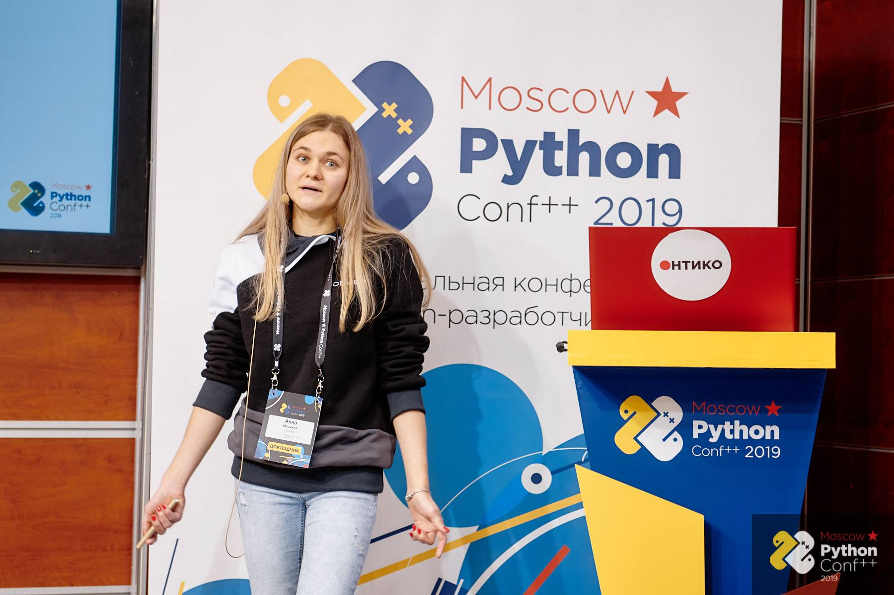

# Как создать 10 приложений из одного и не сойти с ума

<a href = "https://conf.python.ru/2019"> Moscow Python Conf++</a> 

*Анна Мошкина, [IPONWEB](https://www.iponweb.com/)*

[Слайды](https://docs.google.com/presentation/d/1dCck9sMmuUQPvCir9rV0ht8mwksHtyVM2q5JiaZ1yvI/edit#slide=id.g43beb5c952_0_0)

- [Об IPONWEB](#Об_IPONWEB)
- [Как мы штампуем админки](#Как_мы_штампуем_админки)
- [Термины](#Термины)
- [Гибкая структура БД](#Гибкая_структура_БД)
- [Тестирование](#Тестирование)
- [Вопросы](#Вопросы)

## Об IPONWEB

* IPONWEB - системы автоматизации показа рекламы. Обрабатывает запросы в рекламную систему. 
* Делаем UI для таких систем, для администраторов. Клиенты - рекламодатели и паблишеры, владельцы сайтов, экранов, приложений, агентства. 
* Клиентские проекты
* No highload

## Как мы штампуем админки
 
 * Начинали с одного простого проекта на django
 * Появилось требование, что таких проектов разных, но похожих друг на друга, будет много. Следующие копипастим... 
 * Но обнаружились проблемы, приходилось менять код в неск местах, копипастились ошибки. 
 * Общую часть решили вынести в библиотеку, проект подключает компоненты из нее. Сменили несколько подходов к организации этой либы.  
* Сейчас мы описываем подключением компонентов либы с помощью JSOn based DSL, который мы называем конфигурацией. 
* Фронт на ангуляре, сборка с помощью webpack, логика читается из json-конфига, размером 1000 строк. Часть генерится автоматически, часть - руками. UI на его основе отрисовывает форму и ее содержимое. Для клиентов они разные. Бэкэнл процессит конфиг, прежде чем отдать в UI.
* No rocket science, аналитики или вычислений. Он предоставляет CRUD, создать XML с настройками рекламной системой. Django+DRF.  Считывает json один раз на старте приложения.  
* Если пользователю не должны быть доступны части системы - отдает 403. 

## Термины

* Entity, сущность - форма.
* Feature - отдельные поля, части. 
* Endpoint - URL. 

* В конфигурации есть секции для всех этих компонентов. 

## Гибкая структура БД

* PostgreSQL
* Гибкая структура на основе many2many связей. Креатив храним отдельно от свойств, сущность отдельно от фичей. LinkRegistry - хранит ссылку на запись в обеих таблицах, записи представляют единое целое - весь объект. 
* Ходить в каждую таблицу отдельно неудобно. Мы используем динамические модели и сериалайзеры. В модели есть только айдишник. С помощью динамического создания типа и сохраняем в глобал реджистри, откуда и используем. 
* Как они отвечают за сбор уже сохранненных данных, собранных из моделей: сериалайзеры обычные DRF, валидируют данные, а также раскладывают по таблицам. Могут смотреть в модель и понимать, где оно хранится по типу полей в модели. Самописные филды, которые отвечают за связь с другиим таблицами. 
Если поле относится к другой таблице, то сериалайзер это понимает, данные друг с другом связываются внутри модели. В спец филдах мы переопределяем механизм дескрипторов. Под капотом делаем линковку через таблицу между значениями, которые пользователь передал.
* fromDB() метод в модели, которому в параметре приходит tuple, он его конвертит в dict, инициализирует модель, получает ее инстантс и возвращает его. Используем переопределенный метод fromDB(), мы получаем в tuple только id,а мы хотим все атрибуты. Поэтому берем в нем доп данные из других таблиц, инициализируем и отдаем. 
* Так происходит везде, где вы работаете с querysets. В приложении получаете нормальные сформированные объекты со всеми полями внутри модели.
* У нас оптимизирован prefetch django под наш юз кейс. 
* Почему Django+PS - удобно для команды. 

## Тестирование

* Много тестируем, так как фреймворк сложный. 
* тестраннер - pytest. 
* Тесты для ядра и в проектах
* В ядре есть юниты, плагин pytest-django, тестируем эндпойнты прямо в либе. 
* Функциональные тесты на апи, можно давать json конфигурацию. Для каждого теста можно указать свою. 
* dummy names для сущностей (Emma, Anna, etc), с которыми тестируем код в ядре, так как не хотим замыкаться на бизнес-контекст. 
* Всю работу с базой тестируем через апи
* Тесты в проектах. Тесты на ядро и тесты, которые подключаются в проектах (project-compat). Они смотрят в конфиг, понимают, какие сущности используют фичу и прогоняют тесты для найденных. 
* В проектах не используем dummy names или тестовую конфигурацию, только настоящую. 
* E2E тесты, run by protractor, json. 
* Хелперы для генерации тестовых данных, учитывают конфиг и собирают валидные тестовые данные в зависимости от него. 

## Вопросы

* У вас есть библиотека, джанго проект, как вы работаете с ней на уровне импортов? Импортируете в проект оттуда зависимости пипом? Да, именно так, это не куски кода, а джанго приложение, для проекта -  это зависимость отдельно упакованная и импортированная. Импорты не копипастим, подключаем приложение из либы, пишем конфиг. 
* JSON, Почему? Дискуссионный вопрос, я не умею читать yaml. 
* Участвует ли разработка со стороны заказчика. Нет, у нас не не аутсорс, а компания поддерживает решения для клиента полноценно. 
* Сравнивали ли подход кастомизации модели с вариантом делать все модели общими. Да, мы делали один проект, где была жесткая структура, иерархия объектов, но это сложно кастомизировать и выдирать сущности, приходилось переопределять код в проекте и это было неудобно. 
* Что будет, если поменять что-то местами в json - порядок не важен. Нет, нельзя менять этот конфиг на лету без передеплоивания. Динамический конфиг есть только на UI. Была идея, что пиэмы могли бы менять конфиг, но идея оказалась не актуальной. 
* Вы говорите, что большинство приложений - это админки, но не все видят все. У пользователей-администраторов есть разные роли, рекламные кампании могут быть поделены по регионам, по клиентам, иногда рекламодатели напрямую смотрят в этот интерфейс, их нужно разграничивать. 
* Общие части в либе используются как фичи для сущностей, а какие примеры? Например, date range на рекламной кампании, под кампанией могут быть другие сущности поменьше, внешние id, сервисы, например, дублирование объектов, импорт, bulk upload объектов.
* Какие версии питона - 2.7, переход на 3.5, джанго 1.9, двигаемся ко 2. 
* Почему не написать фичи отдельно? У нас есть практика написания фич в проекте. Подключаем мы не все, а только то, что нужно. 
* Динамически генерируются модели + дескрипторы кастомные - когда падают, сложно дебажить. Как вы это делаете? Всегда можно посмотреть на конфиг и понять, что туда входит, модель можно заимпортить и посмотреть все поля. 
* Берем сущность, генерируем миграции, как вы решаете проблемы с этим? Ответ: Запилен концепт плоских таблиц. 
* Вы пишете join() вручную или это реализовано внутри fromDB()? Все делается ORM.
* Постгря на распределенных серверах? Нет, проекты не настолько большие. 
* Как вы боретесь с копипастой в DSL? есть валидация, фичу нужно для подключения зарегистрировать, если опечатка - упадет с ошибкой, в тестах не копипастим. Есть механизм, который позволяет базовые конфиги писать в ядре и переиспользовать. Например, мы так делаем для юзеров. 
* постгрес используется как entity attribute value, почему? Удобно ORM, типизация, структура, в NoSQL могут быть проблемы с восстановлением данных и использованием в коде.  
* почему конфигурации не на питоне? Она не должна позволять много, быть строже, декларативный стиль позволяет только то, что нужно. 
* Как вы зарелизите изменения в общей библиотеке, перегенерировать все проекты? У нас есть автоматизированные тесты на jenkins, можно запустить compat тесты с любым проектом, проектами. 

## Фоточки

