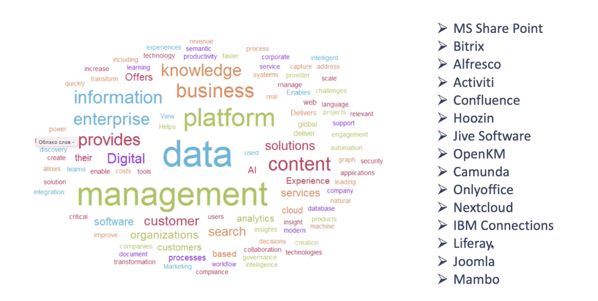

# Тренды knowledge management. Как разработчикам заработать на управлении знаниями

**Владимир Лещенко, KM talks**

## Тренды

На диаграмме Гартнера 2003 года на пике находится все то, что сейчас покупают российские компании, это коммуникации, это семантический поиск. 

APQC - американская ассоциация, которая занимается анализом мировых тенденций по менеджменту знаний. 
Важно дополнять продукты по разработке методологиями. 

Какие наиболее важные изменения сейчас самые важные в аналитическом портфеле компаний? Во-первых, это цифровизация и цифровая трансформация. Продукты по менеджменту знаний могут помочь эти изменения внедрить. 

Вторая волна продуктов, которая еще впереди и на пике, включает в себя системы рекомендации контента на основе семантических моделей, системы автоматической классификации контента, чтобы не пополнять базу знаний вручную, когнитивный поиск. 

В этой части есть зона роста для всех, заказчики тоже не всегда могут именно так сформулировать. \

Когнитивный поиск - это возможность для пользователя искать в неструктурированнм хаосе то, что ему нужно и нужной релеватности. 

Еще один такой тренд - это графовые базы данных. Картирование и формирование связей - то, на что делают акцент технологические холдинги. Эта технология будет тиражироваться и дальше, компетенции в этой области востребованы. 

## Способы внедрения

Во-первых, это journey mapping - инструмент управления клиентским опытом через аналитику потребления, так мы получаем задания на изменения. Заказчик объясняет вам, что хочет своими словами, поэтому важно собрать пожелания потребителей внутри компании-заказчика, собрать его боль из первых рук.

Владимир взял 200 компаний, которые являются провайдерами решений по менеджменту знаний, семантическое облако показало, что подавляющее большинство предлагают управление данными и контентом, очень редко встречаются в позицировании слова знания, сервис, создание, трансформация, критические. 

Компаниям важно формировать видение и идти в зоны, которые недопредставлены. 

Еще один тренд - это автоклассификационные инструменты. Работа по ручной классификации - титаническая, метаданных десятки. 

## Зачем?

* Увеличение скорости создания продуктов
* Демократизация доступ к знаниями
* Поддержка уровня компемпетенций (компания заинтересована в росте и в удержании сотрудника, для этого формируются проф.сообщества, инструменты передачи и пополнения знаний)
* Трансфер экспертизы.

