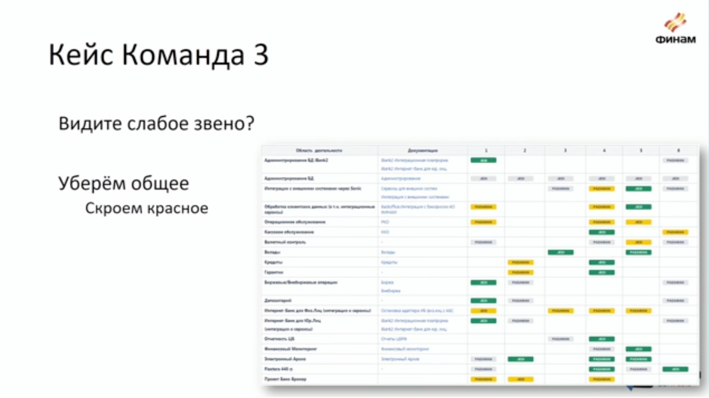
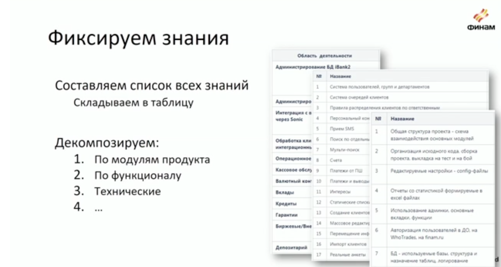

# Знания и компетенции в команде: найти, увидеть, прокачать

**Алексей Трошин, ФИНАМ**

## Кто такой эксперт? 

Человек с глубокой компенетцией в своей предметной области, для бизнеса - это единая точка входа
Минусы - долго растить, сложно ходить в отпуск

Bus factor - мера сосредоточения информации, сколько человек должен переехать автобус, чтобы на проекте случилась беда. 

Надо тренировать и обучать джедаев, это компетенция, к которой нужно вырасти. Падаван стремится к объему знаний джедая, может замещать его в отпуске, джедай остается лицом принимающим решения. 

* Визуализируем в табличку. По горизонтали - продукты, области, модули, по вертикали - сотрудники. 
* Правила: джедай у каждого продукта один, не менее одного падавана, равномерно распределялись. 

## Контролируем обмен знаниями

* Составляем карту знаний в каждом продукте и декомпозируем.
* Добавляем столбец с документацией.
* Добавляем людей и оцениваем их уровень знаний, где 1 - не видел, не трогал, 2 - почитал документацию, зашел запустил на сервере, 3 - что-то правил, помогал, 4 - умеет работать полноценно. 
* Как мне, менеджеру, сразу увидеть наращивание знаний внутри команды? Мы покрасили квалратики в разные цвета. Все 1 - красный, все 4 - зеленый. Остальное - серый, желтый не использовали, не понятное промежуточное состояние.  

## Правила

* Делаем упор на прокачку джедаев.
* Падаваны потом, требования пониже, падаван может "зеленеть", когда делал хотя бы что-то, потом приподнимаем планку.
* Анализируем в динамике.

## А как качать?

* 1 строка - 1 артефакт, страница документации, повышайте покрытие.
* Если пустые места, возможно, вы слишком сильно разбили продукт, модуль, а документация у вас менее гранулярная. 
* Тимлид садится и записывает, экспертный метод.
* или сотрудник разбирается, реверс инжинирит и описывает, что делает, исследовательский метод.
* Актуализируем! Права не редактирование есть у всех, нашел неточность - исправил. 
* Подписываем команду на изменения. Контролируем удаление. 

## Как использовать? 

* Использовать для приоритизации тасков, распределения между разработчиками
* План развития новичков
* KPI
* Вытаскиваем и перераспределяем знания, всегда будут люди, которые не хотят делиться. 
* Не используйте для наказаний или чтобы избавиться от сотрудника! Расширение опыта не должно быть угрозой. 

## Нашли "слабое звено"

* Мы обнаружили, что один сотрудник занимается только одной системой, в паре других только базовые знания. 

## Итоги

* Три простых шага, чтобы начать собирать и систематизировать знания в команде. 
* Остерегайтесь темной стороны силы, не используйте для санкций. 

## Вопросы

* Вопрос: Что есть люди хотят развиваться туда, куда не выгодно продукту? Стоит ли препятствовать?
* Ответ: Препятствовтаь не стоит, посмотрите на это с точки зрения коэффициентов, в игре прокачай свои скиллы сотрудникам станет понятно, что туда, где нужно вам - легче, а туда, где нужно им - сложнее. Но, помните, что разработчики легко ломают систему. 

* Вопрос: Как остарегаться темной стороны, как бороться с теми, кто не хочет делиться? 
* Ответ: Смотрите на светлую сторону, масштабируйте на другие команды, работайте с единомышленниками, нельзя давать ощущение опасности. 

* Вопрос: Как собрать исходную оценку от ребят?  
* Ответ: Это командная игра. Оценка ставится по практике работы с модулем, например, правил хотя бы один баг, почитал документацию, делал несколько задач. Смотрим в джире к каким компонентам привязан таск. К картинкам, что я показывал мы шли полтора года. 

* Вопрос: Две основных проблемы - это недозагруженность и перегруженность, как быть с теми, кто итак перегружен, обладают критическими знаниями, нет возможности их подключать к новым задачам.  
* Ответ: Эта система помогает провести аналитику и пойти к руководству, чтобы на практике показать, что у вас человек загружен, давайте разгрузим его, заьем мы можем направлять потом задач на падавана. Да, он на старте потратит время на обучение, написание документации на будущее, зато потом сможет уйти в отпуск спокойно. Руководство начинает смотреть на мир нашими глазами, у них есть реальные данные, факты.

* Вопрос: Вы сказали, что практикуете гибкие методологии, но в них документация вторична. 
* Ответ: Да, для меня документация - это способ контроля, а не часть процесса разработки, еще у нас есть техтолки для обмена знаниями.

* Вопрос: Как боретесь с неактуальностью документации? 
* Ответ: ревью ради ревью мы не делаем, актуализируют и отмечают неточность те, кто читает ее, кто по ней учится. Мы начинали с нуля, уровень боли от полного отсутствия документации была очень высокая, даже если то, что мы успели покрыть хоть на 10 процентов устарело - не страшно по сравнению с исходной точкой. 

* Вопрос: Что если кто-то висит долго в красной зоне? 
* Ответ: Красного не должно быть, это ахтунг, проверяем наличие красных кирпичиков на каждой тимлидской встрече. Результаты этой встречи записываем в конфлуэнс, там есть чек-лист и смотрим, сравниваем статус в команде каждого тимлида. 